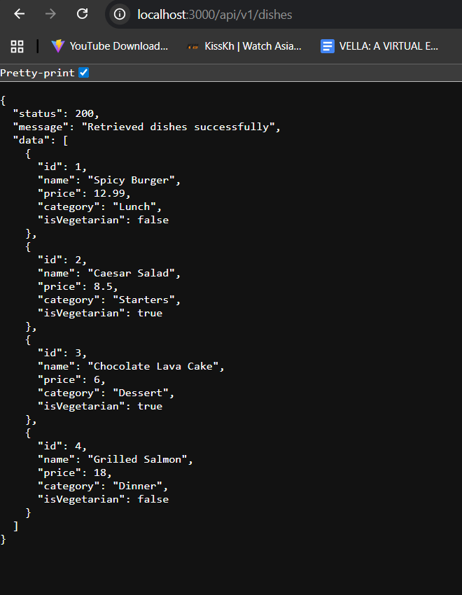

Markdown
2. # RESTful API Activity - Avel Nathaniel  M. Sanchez
3. ## Best Practices Implementation
4. **1. Environment Variables:**
5. - Why did we put `BASE_URI` in `.env` instead of hardcoding it?
6. - Answer: We put base_url in .env to avoid configuration values in the source code.

7. **2. Resource Modeling:**
8. - Why did we use plural nouns (e.g., `/dishes`) for our routes?
9. - Answer: We use plural nouns for our routes to represent the collections of resources.

11. - When do we use `201 Created` vs `200 OK`?
12. - Answer: 201 Created is use when a new resource is successfully created while 200 OK is use when a request is successful but it does not create new resource.
13. - Why is it important to return `404` instead of just an empty array or a generic error?
14. - Answer: Returning 404 Not Found allows the client to know that the requested resource does not exist.
15.
16. **4. Testing:**
(Paste a screenshot of a successful GET request here)

